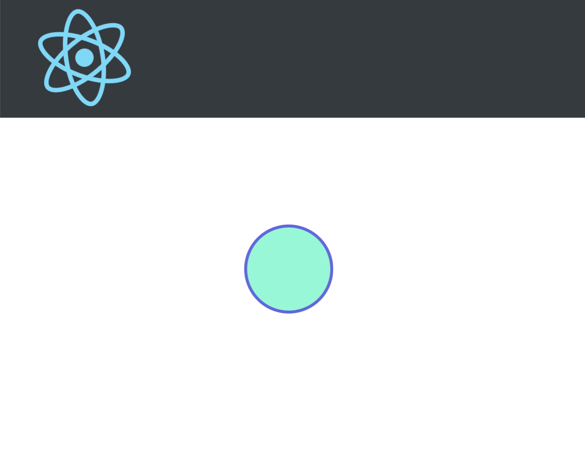

> Adapted demo from *nordic.js talk &mdash; building distributed systems, by James Simpson (@goldfire)* for use with a node.js cluster.
> (https://goldfirestudios.com/nordic-js-building-distributed-systems)

# socket-music

## React-Socket.io sandbox

## 🌎 [Live](https://socket-music.herokuapp.com/)

### play together live on the page

> Users are assigned random colors
> pitch is playing according to the taps y axis

### Contributions are welcome!

### Thanks, 
